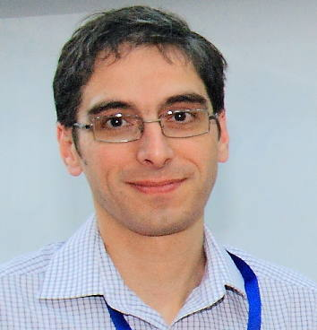

---
hide:
  - footer
---

# Evgeni Burovski

My background is computational physics, and these days I mainly work on
infrastructure of the PyData ecosystem. 

My research activities mostly relate to studying collective effects in many-body
systems, and often involve developing appropriate numerical algorithms. 
Most of my papers are available from [arXiv](http://arxiv.org/a/burovski_e_1) or
[ORCID](https://orcid.org/0000-0001-8149-0483).

My open-source work is on [Github](https://github.com/ev-br).

This site is mainly to keep historic materials which do not have a dedicated home.
For example, teaching materials for various physics and applied maths courses I
taught over the last decade or so.

The best way of contacting me is _evgeny-dot-burovskiy-at-gmail_.

